### 使用

- electron   (跨平台、使用版本V8.4.0)
- vue       （路由/SPA）
- webpack   （构建）
- node/npm
- lowdb     (本地存储)

# 依赖

需要Geth，我用的是 ganache-cli 来模拟测试的；

https://github.com/trufflesuite/ganache-cli

启动步骤

> geth --syncmode "fast" --rpc --rpccorsdomain "http://localhost:9080" --rpcapi personal,web3,eth,net


``` bash
# install dependencies
-  npm install -g ganache-cli

# 命令行输入下面命令，并且保持运行状态；
-  ganache-cli
```

如果不启动，使用`infura.io`提供的接口

#### Build Setup

``` bash
# cd

# install dependencies
npm install

# serve with hot reload at localhost:9080
npm run dev

# build electron application for production
npm run build


```

#### 页面如下；

这个项目是打算简单的熟悉以太的逻辑后，再切到做CZR的项目的（CZR是我所在公司做的一个公链项目）；

所以这个钱包中，货币的单位`Eth`，使用的是`CZR`（为了切换方便的，其实单位是以太），

后续的开发都在：[CanonChain钱包](https://github.com/canonchain/canonchain-wallet);

本项目实现功能：
- 创建ETH地址
- 导入ETH地址
    - 通过file文件导入地址
    - 通过私钥导入
- 删除地址
- 创建联系人
- 删除联系人
- 语言设置
- 转账
- 地址详情

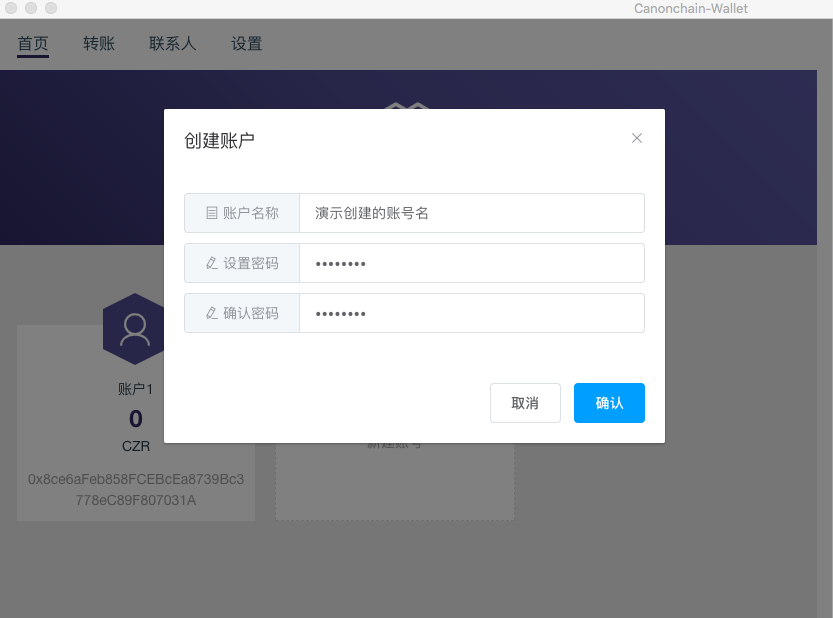
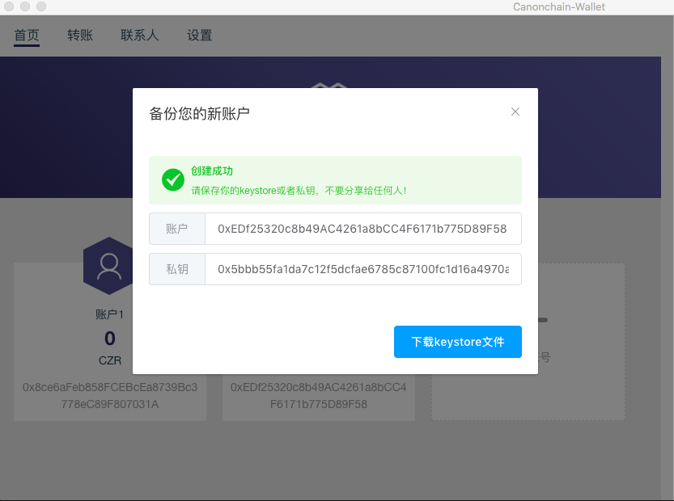
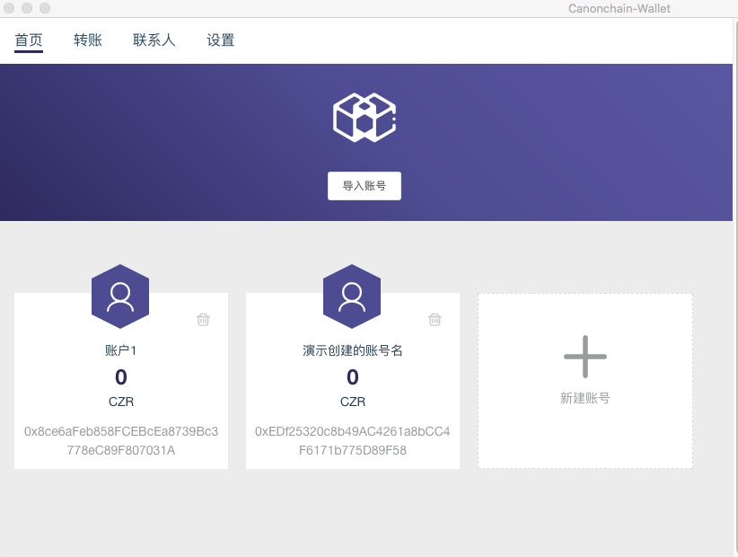
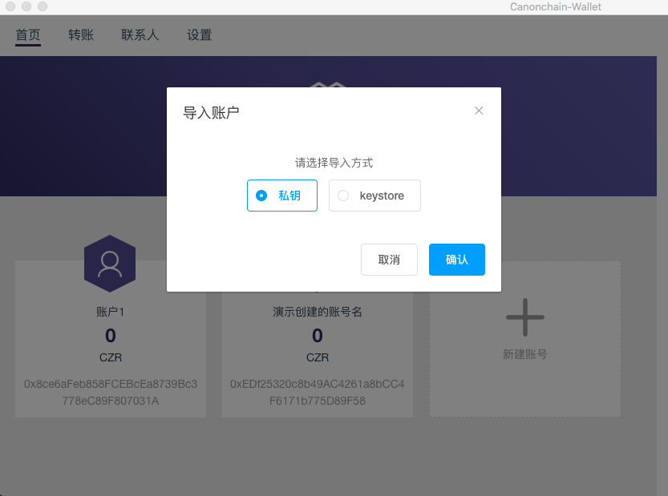
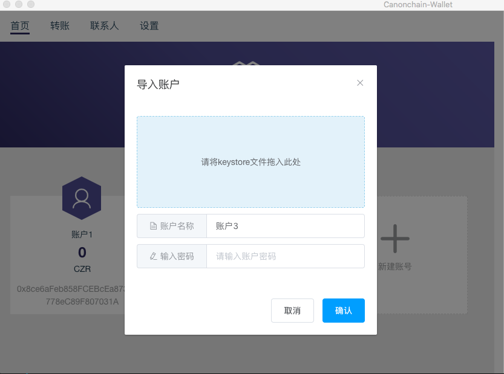
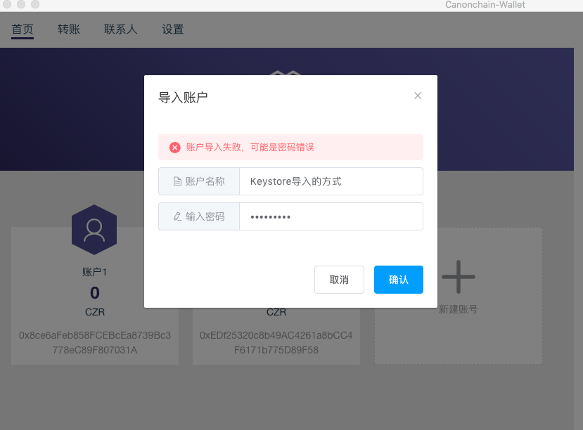
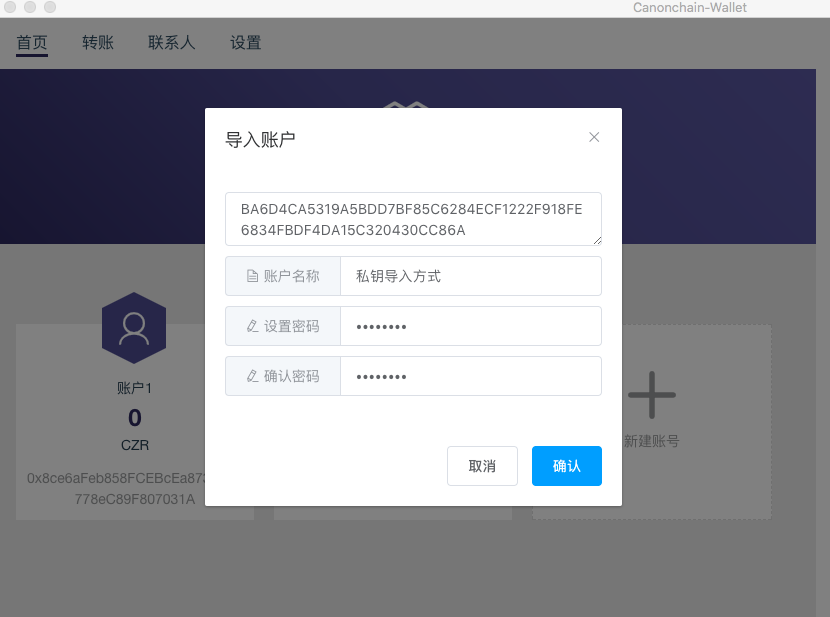
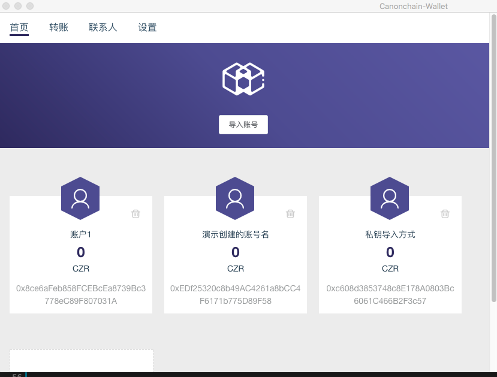
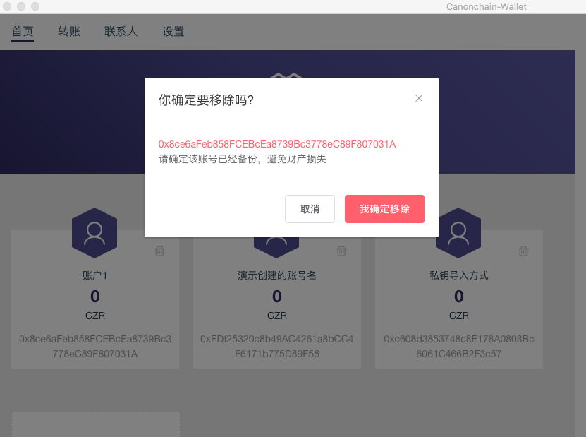
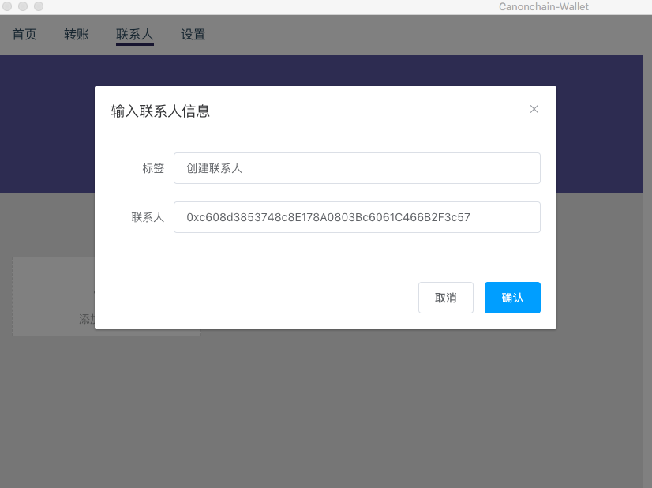
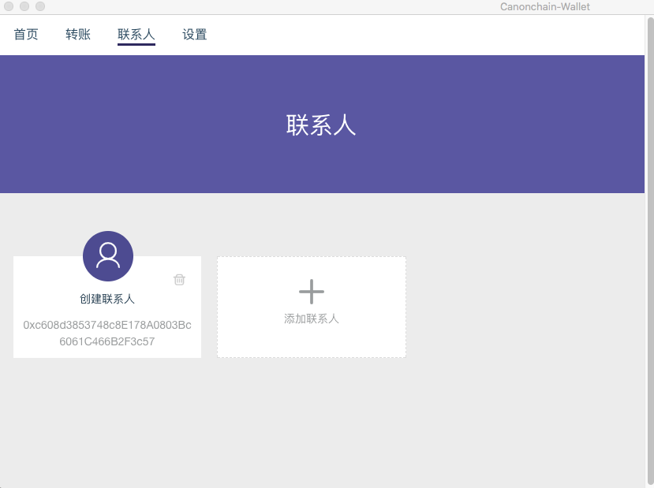
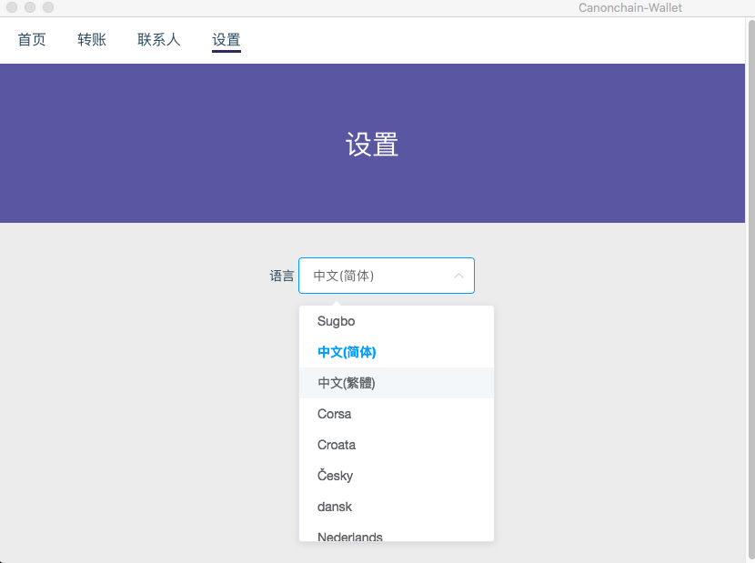
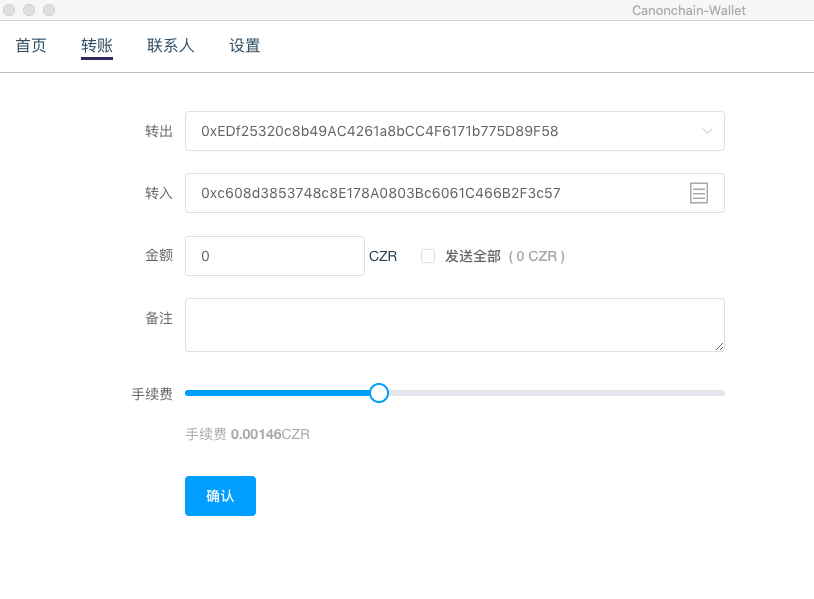
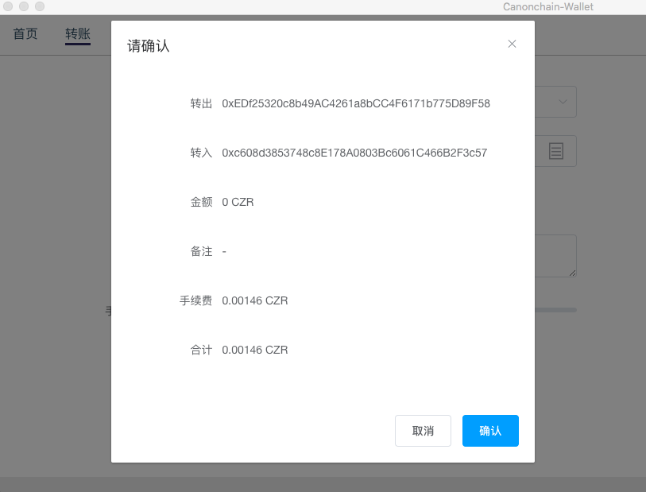
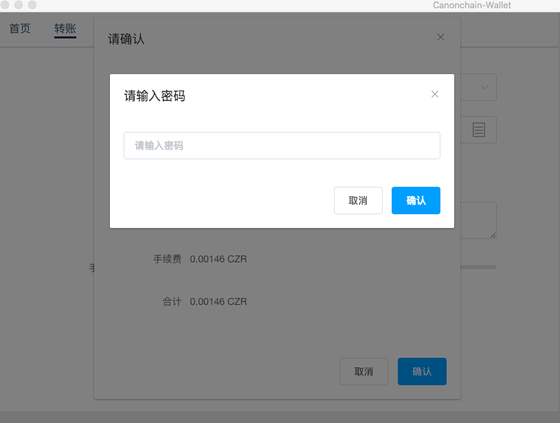


